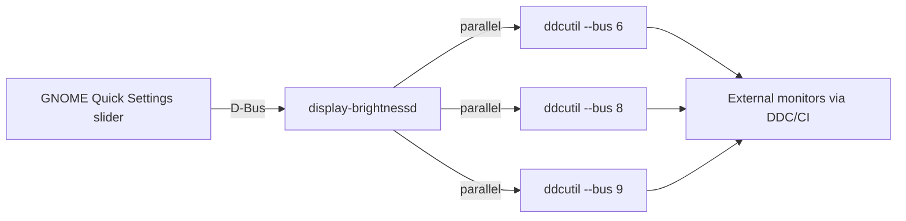

# Display Brightness

Control all external monitors at once from the Ubuntu Quick Settings panel, using [ddcutil](https://www.ddcutil.com/) over DDC/CI (DisplayPort/HDMI).

## Motivation

With multiple monitors, matching brightness manually on each panel is slow. ddcutil can set brightness programmatically:

```bash
for d in 1 2 3; do
    ddcutil --display "$d" setvcp 10 50
done
```

This project adds a Go daemon plus a GNOME Shell extension so you get a slider next to volume in Quick Settings.

## Requirements

- Ubuntu 24.04+ with GNOME Shell 46
- `ddcutil` installed and working (`ddcutil detect`)
- User in the `i2c` group (or equivalent udev rules) for DDC/CI access
- Go 1.26.x to build (minimum 1.26.0; any patch version works; runtime is a single binary)

## Install

First install or after any change (daemon, extension, systemd unit):

```bash
make deploy
```

This builds `~/.local/bin/display-brightnessd`, installs the GNOME extension and systemd user unit, and restarts the service.

Equivalent to `make install` followed by `make restart`. The underlying script is [`scripts/install.sh`](scripts/install.sh).

## Development

| Command | What it does |
|---------|--------------|
| `make deploy` | Build, install binary + extension + systemd unit, restart service |
| `make build` | Compile to `bin/display-brightnessd` only |
| `make test` | Run Go tests |
| `make restart` | Restart user service only |
| `make clean-cache` | Clear Go build cache (use if toolchain version mismatch) |

`GOTOOLCHAIN=go1.26.0+auto` is set by the Makefile so any Go 1.26.x patch can be used automatically.

Daemon changes take effect immediately after `make deploy`. Extension JS changes require a GNOME Shell restart (`Alt+F2`, `r`) to appear in Quick Settings.

## Manual test

```bash
# Service status
systemctl --user status display-brightness

# Set all monitors to 50%
busctl --user call org.display.Brightness /org/display/Brightness \
  org.display.Brightness SetBrightness y 50

# Read current average brightness
busctl --user call org.display.Brightness /org/display/Brightness \
  org.display.Brightness GetBrightness
```

## Build only

```bash
go build -o display-brightnessd ./cmd/display-brightnessd
```

## Troubleshooting

- **No displays detected** — run `ddcutil detect`; check i2c permissions on the buses your monitors use (see `I2C bus:` lines in detect output). After reboot monitors may not be ready when the daemon starts; it retries detect for ~30s, then again on the next slider move or `RefreshDisplays` D-Bus call
- **`/dev/i2c-0` EACCES in logs** — harmless if brightness changes work. ddcutil probes all I2C buses; your monitors use other buses (e.g. `/dev/i2c-6`). The daemon uses `--bus` per monitor for fast parallel updates. To silence the warning: `sudo chmod g+rw /dev/i2c-0` or add yourself to the `i2c` group ([ddcutil i2c permissions](https://www.ddcutil.com/i2c_permissions))
- **`failed to set brightness on all displays`** — should not occur with `--bus`-based parallel calls; if it does, run `ddcutil detect` and test `ddcutil --bus N setvcp 10 50 --noverify` for each bus
- **Service not running** — `journalctl --user -u display-brightness -f`
- **Slider missing thumb / wrong position after boot** — the extension syncs from `GetBrightness` or `BrightnessChanged` when the daemon finishes display detection; slow monitors trigger automatic retries. Restart GNOME Shell (`Alt+F2`, `r`) after `make deploy` if the extension was updated
- **Slider disabled** — ensure the D-Bus service is active before enabling the extension
- **Extension missing after install** — restart GNOME Shell (`Alt+F2`, `r`) or log out/in; new extensions are picked up on shell restart
- **Go version mismatch** (`compile: version "go1.26.x" does not match go tool version`) — run `make clean-cache && make deploy`

## How it works

The service has three layers: a GNOME Shell extension (UI), a Go daemon (logic), and `ddcutil` (hardware access).



### Components

| Part | Role |
|------|------|
| `extension/display-brightness@legion/` | Slider in Quick Settings; talks to the daemon over the session D-Bus |
| `display-brightnessd` | Go 1.26 user service; owns `org.display.Brightness` on the session bus |
| `ddcutil` | External CLI that sends DDC/CI commands over I2C to each monitor |

The daemon is started by a systemd user unit (`display-brightness.service`) and registers the bus name `org.display.Brightness`.

### Startup

1. The daemon registers on D-Bus immediately, then runs `ddcutil detect --brief` in the background with retries (monitors may not respond right after boot).
2. When displays are found, it reads max brightness (VCP 0x10) in parallel, caches per bus, and emits `BrightnessChanged` with the current average.
3. The extension calls `RefreshDisplays` then `GetBrightness` when the service appears; if monitors are still waking, it retries every 3s (up to 10 times).
4. If `ddcutil` reports a harmless `/dev/i2c-0` permission warning, the daemon logs it once and continues.

### When you move the slider

1. The extension calls `SetBrightness(percent)` on D-Bus (0–100).
2. The controller **debounces** rapid changes (200 ms) so dragging the slider does not spawn dozens of `ddcutil` processes.
3. After debounce, one goroutine per monitor runs `ddcutil --bus N setvcp 10 <value> --noverify` **in parallel**.
4. Each monitor may have a different hardware max (e.g. 100 vs 80). The daemon converts the requested percent to an absolute value using the cached max for that bus, so all panels show the same relative brightness.
5. On success, the daemon emits `BrightnessChanged` so the slider stays in sync without polling.

### Why `--bus` instead of `--display`

`ddcutil --display N` re-probes every I2C device on each call. Several such calls in parallel clash during detection and often fail with "Display not found". Targeting `--bus N` talks directly to one `/dev/i2c-N` device, so parallel updates are fast (~0.6 s for three monitors) and reliable.

### D-Bus API

| Method / signal | Description |
|-----------------|-------------|
| `GetBrightness()` → `y` | Average brightness 0–100 across all monitors |
| `SetBrightness(y)` | Set all monitors to the same percent (debounced) |
| `GetDisplays()` → `as` | Cached ddcutil display numbers |
| `RefreshDisplays()` → `as` | Re-run detect and return display numbers |
| `BrightnessChanged(y)` | Emitted after a successful apply or when displays are first detected at startup |

## Architecture

- `cmd/display-brightnessd/` — daemon entry point
- `internal/brightness/` — display discovery, debounce, parallel apply, max-brightness cache
- `internal/ddcutil/` — `ddcutil` wrapper (`detect`, `getvcp`, `setvcp`, stderr noise filtering)
- `internal/dbus/` — session D-Bus service
- `extension/` — GNOME Shell Quick Settings slider
- `systemd/display-brightness.service` — user systemd unit (`Type=dbus`)
